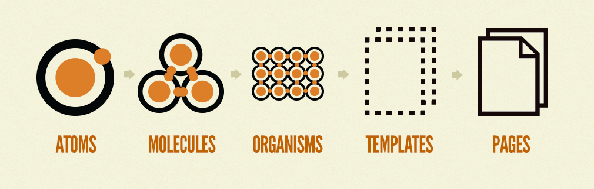
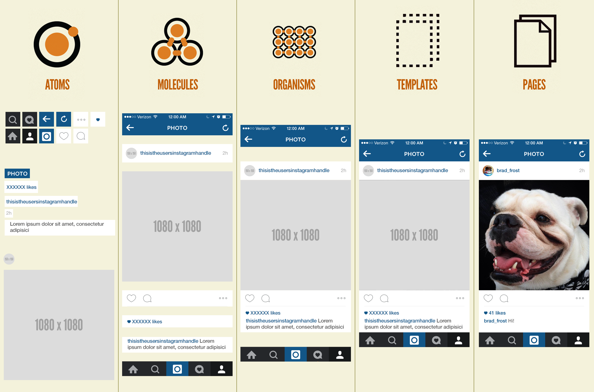

# Atomic Design

 **Atomic design is not a linear process**, but rather a mental model to help us think of our user interfaces as both a cohesive whole and a collection of parts _at the same time_. Each of the five stages plays a key role in the hierarchy of our interface design systems.

## ATOMS

**atoms of our interfaces serve as the foundational building blocks that comprise all our user interfaces**. 

These atoms include **basic HTML elements like form labels, inputs, buttons, and others** that can’t be broken down any further without ceasing to be functional.

each interface atom has its own unique properties, such as the dimensions of a hero image, or the font size of a primary heading.These innate properties influence how each atom should be applied to the broader user interface system.

## MOLECULES

In interfaces, **molecules are relatively simple groups of UI elements functioning together as a unit**. For example, a form label, search input, and button can join together to create a search form molecule.  

creating simple UI molecules makes testing easier, encourages reusability, and promotes consistency throughout the interface.

## ORGANISMS

 **Organisms are relatively complex UI components composed of groups of molecules and/or atoms and/or other organisms**. These organisms form distinct sections of an interface.

Let’s revisit our search form molecule. A search form can often be found in the header of many web experiences, so let’s put that search form molecule into the context of a header organism.

The header forms a standalone section of an interface, even though it contains several smaller pieces of interface with their own unique properties and functionality.

Organisms can consist of similar or different molecule types.

* A header organism might consist of dissimilar elements such as a logo image, primary navigation list, and search form.
* While some organisms might consist of different types of molecules, other organisms might consist of the same molecule repeated over and over again.
* Organisms demonstrate those smaller, simpler components in action and serve as distinct patterns that can be used again and again.

## TEMPLATES

 **Templates are page-level objects that place components into a layout and articulate the design’s underlying content structure.** To build on our previous example, we can take the header organism and apply it to a homepage template.

 This homepage template displays all the necessary page components functioning together, which **provides context for these relatively abstract molecules and organisms**. 

  important characteristic of templates is that they **focus on the page’s underlying content structure** rather than the page’s final content.

## PAGES

 **Pages are specific instances of templates that show what a UI looks like with real representative content in place**. Building on our previous example, we can take the homepage template and pour representative text, images, and media into the template to show real content in action.

 In addition to demonstrating the final interface as your users will see it, **pages are essential for testing the effectiveness of the underlying design system**. It is at the page stage that we’re able to take a look at how all those patterns hold up when real content is applied to the design system. 

We must create systems that establish reusable design patterns and also accurately reflect the reality of the content we’re putting inside of those patterns.

**Pages also provide a place to articulate variations in templates**, which is crucial for establishing robust and reliant design systems. Here are just a few examples of template variations:

* A user has one item in their shopping cart and another user has ten items in their cart.
* A web app’s dashboard typically shows recent activity, but that section is suppressed for first-time users.
* One article headline might be 40 characters long, while another article headline might be 340 characters long.
* Users with administrative privileges might see additional buttons and options on their dashboard compared to users who aren’t admins.

In all of these examples, the underlying templates are the same, but the user interfaces change to reflect the dynamic nature of the content. These variations directly influence how the underlying molecules, organisms, and templates are constructed. Therefore, creating pages that account for these variations helps us create more resilient design systems.

