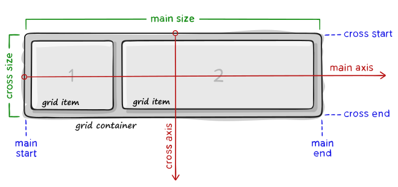

# Grid

* Grid Layout is the most powerful layout system available in CSS.
* It is a 2-dimensional system, meaning it can handle both columns and rows, unlike flexbox which is largely a 1-dimensional system.
* You work with Grid Layout by applying CSS rules both to a parent element \(which becomes the Grid Container\) and to that element’s children \(which become Grid Items\). 



## Grid Container Terminology

### **Grid Container**

* The element on which **`display: grid`** is applied.
* It’s the direct parent of all the grid items. 
* In this example **`container`** is the grid container.

```markup
<div class="container">
  <div class="item item-1"> </div>
  <div class="item item-2"> </div>
  <div class="item item-3"> </div>
</div>
```

### **Grid Line**

* The dividing lines that make up the structure of the grid.
* They can be either vertical \(“column grid lines”\) or horizontal \(“row grid lines”\) and reside on either side of a row or column.
* Here the yellow line is an example of a column grid line.


### **Grid Track**

* The space between two adjacent grid lines.
* You can think of them like the columns or rows of the grid.
* Here’s the grid track between the second and third row grid lines.


### **Grid Area**

* The total space surrounded by four grid lines.
* A grid area may be composed of any number of grid cells.
* Here’s the grid area between row grid lines 1 and 3, and column grid lines 1 and 3.


## **Grid Children Terminology**

### **Grid Item**

* The children \(i.e. _**direct**_ descendants\) of the **grid container**.
* Here the **`item`** elements are grid items, but **`sub-item`** isn’t.

```markup
<div class="container">
  <div class="item"> </div>
  <div class="item">
    <p class="sub-item"> </p>
  </div>
  <div class="item"> </div>
</div>
```

### **Grid Cell**

* The space between two adjacent row and two adjacent column grid lines.
* It’s a single “unit” of the grid.
* Here’s the grid cell between row grid lines 1 and 2, and column grid lines 2 and 3.


