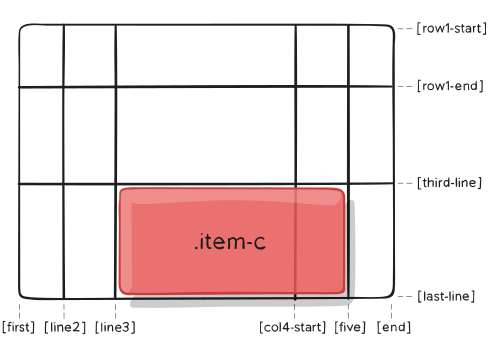
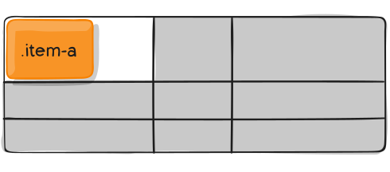
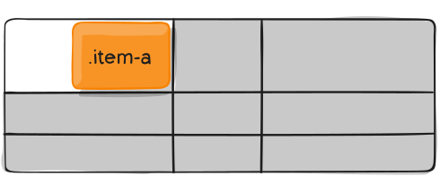
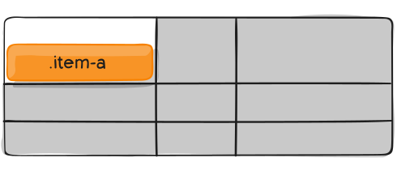

# Children \(Grid Items\) Properties


**NOTE:   `float`**, **`display: inline-block`**, **`display: table-cell`**,**`vertical-align`** and **`column-*`** properties have **no effect** on a **grid item.**


**Grid Items Properties:**

**grid-column/row ❖ grid-area** 

**❖ justify-self ❖ align-self**

### grid-column / grid-row

Shorthand for **`grid-column-start + grid-column-end`**, and **`grid-row-start + grid-row-end`**, respectively.

Values:

**`<start-line> / <end-line>`** – each one accepts all the same values as the longhand version, including span


**NOTE:**     If no **`<end-line>`** value is declared, the item will **span 1** track by **default**.


```css
.item-c {
  grid-column: 3 / span 2;
  grid-row: third-line / 4;
  grid-column: 1 / 4;
  grid-row: 1 / 2;
}
```



```css
.item-c {
  grid-column: 3 / span 2;
  grid-row: third-line / 4;
}
```





### grid-area

* Gives an item a name so that it can be referenced by a template created with the **`grid-template-areas`** property. 
* Alternatively, this property can be used as an even shorter shorthand for **`grid-row-start` + `grid-column-start` +** **`grid-row-end` + `grid-column-end`**.

Values:

**`<name>`** – a name of your choosing

**`<row-start> / <column-start> / <row-end> / <column-end>`** – can be numbers or named lines

```css
.item {
  grid-area: <name> | <row-start> / <column-start> / <row-end> / <column-end>;
  grid-area: header;
}
```



As a way to assign a name to the item:

```css
.item-d {
  grid-area: header;
}
```

 shorthand for `grid-row-start` + `grid-column-start` + `grid-row-end` + `grid-column-end`.

```css
.item-d {
  grid-area: 1 / col4-start / last-line / 6;
}
```





### justify-self

* _**Aligns**_  a _**grid item**_  _**inside**_ a _**cell**_  _**along**_  the _**inline \(row\) axis**_
* \(as opposed to `align-self` which aligns along the block \(column\) axis\). 
* This value _**applies**_ to a _**grid item**_ inside a _**single cell**_.

**`place-self`** : sets both the **`align-self`** and **`justify-self`** properties in a single declaration.

#### Values:




### `stretch` : fills the whole width of the cell \(this is the default\)







### `start` : aligns grid item to be flush with the start edge of the cell







### `center` : aligns the grid item in the center of the cell







### `end` : aligns the grid item to be flush with the end edge of the cell






```css
.item {
  justify-self: start | end | center | stretch;
  justify-self: start;
}
```

### align-self

* _**Aligns**_  a _**grid item inside**_ a _**cell along**_  the _**block \(column\) axis**_
* \(as opposed to **`justify-self`** which aligns along the inline \(row\) axis\).
* This value _**applies**_ to the _**content**_ inside a _**single grid item**_.

**`place-self`** : sets both the **`align-self`** and **`justify-self`** properties in a single declaration.

#### Values:




### `stretch` : fills the whole height of the cell \(this is the default\)







### `start`**:** aligns the grid item to be flush with the start edge of the cell







### `center` : aligns the grid item in the center of the cell







### `end` : aligns the grid item to be flush with the end edge of the cell






```css
.item {
  align-self: start | end | center | stretch;
}
```

