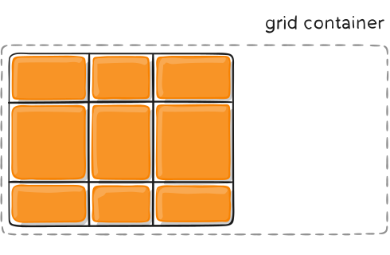
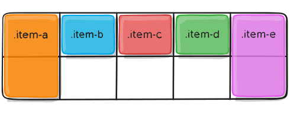

# Parent \(Grid Container\) properties

* **DISPLAY:**           [**`grid`**](parent-grid-container-properties.md#display) **/ `inline-grid`**   
* **PLACEMENT:**    [**`grid-template`**](parent-grid-container-properties.md#grid-template) \([**`grid-template-columns`**](parent-grid-container-properties.md#grid-template-columns-grid-template-rows) ,**`grid-template-rows`**\) , 
*                              [**`grid-template-areas`**](parent-grid-container-properties.md#grid-template-areas) ,[**`grid-auto-columns`**](parent-grid-container-properties.md#grid-auto-columns-grid-auto-rows) and **`grid-auto-rows`** ,  
*                              ****[**`grid-auto-flow`**](parent-grid-container-properties.md#grid-auto-flow)**\`\`**
* **ALIGNMENT:**    [**`gap`**](parent-grid-container-properties.md#column-gap-row-gap) **\(`column-gap`,`row-gap` \),**[**`justify-items`**](parent-grid-container-properties.md#justify-items) ****\(items-inline-row-axis\),
*                             [**`justify-content`**](parent-grid-container-properties.md#justify-content) ****\(grid-inline-row-axis\) ,[**`align-items`**](parent-grid-container-properties.md#align-items) \(items-block- column-axis\)                                         
*                            ****[**`align-content`**](parent-grid-container-properties.md#align-content)\( grid-block-column-axis\)

### display

Defines the element as a grid container and establishes a new grid formatting context for its contents.

Values:

**grid** – generates a block-level grid

**inline-grid** – generates an inline-level grid

```css
.container {
  display: grid | inline-grid;
}
```

### grid-template-columns / grid-template-rows

* Defines the columns and rows of the grid with a space-separated list of values.
*  The values represent the track size, and the space between them represents the grid line.

Values:

**`<track-size>`** – can be a length, a percentage, or a fraction of the free space in the grid \(using the `fr` unit\)

**`<line-name>`** – an arbitrary name of your choosing

```css
.container {
  grid-template-columns: 40px 50px auto 50px 40px;
  grid-template-rows: 25% 100px auto;
}
```


```css
.container {
  grid-template-columns:  ... |   ...;
  grid-template-rows:  ... |   ...;
  grid-template-columns: 1fr 1fr 1fr;
  grid-template-columns: 1fr 50px 1fr 1fr;
}
```

### grid-template-areas

* Defines a grid template by referencing the names of the grid areas which are specified with the **`grid-area`** property.
* Repeating the name of a grid area causes the content to span those cells. 
* A period signifies an empty cell. 
* The syntax itself provides a visualization of the structure of the grid.

Values:

**`<grid-area-name>`** – the name of a grid area specified with grid-area

**\(`.`\)** – a period signifies an empty grid cell

**`none`** – no grid areas are defined

```css
.item-a {
  grid-area: header;
}
.item-b {
  grid-area: main;
}
.item-c {
  grid-area: sidebar;
}
.item-d {
  grid-area: footer;
}

.container {
  display: grid;
  grid-template-columns: 50px 50px 50px 50px;
  grid-template-rows: auto;
  grid-template-areas: 
    "header header header header"
    "main main . sidebar"
    "footer footer footer footer";
}
```


```css
.container {
  grid-template-areas: 
    " | . | none | ..."
    "...";
}
```

### grid-template

A shorthand for setting **`grid-template-rows`**, **`grid-template-columns`**, and **`grid-template-areas`** in a single declaration.

Values:

**none** – sets all three properties to their initial values

 **/**  – sets **`grid-template-columns`** and **`grid-template-rows`** to the specified values, respectively, and sets **`grid-template-areas`** to **`none`**

```css
.container {
  grid-template: none | <grid-template-rows> / <grid-template-columns>;
}
```

### column-gap / row-gap

* Specifies the size of the grid lines.
*  You can think of it like setting the width of the gutters between the columns/rows.

**gap** : A shorthand for **`row-gap`** and **`column-gap`**

Values:

**`<line-size>`** – a length value

```css
.container {
  column-gap: <line-size>;
  row-gap: <line-size>;
  column-gap: 10px;
  row-gap: 15px;
  
  gap: <grid-row-gap> <grid-column-gap>;
  gap: 15px 10px;
}
```

### justify-items

* _**Aligns**_  grid _**items along**_  the _i**nline \(row\) axis**_ ****
*  \(as opposed to **`align-items`** which aligns along the block \(column\) axis\). 
* This value _**applies**_  to _**all grid items inside**_  the container.

**place-items :** sets both the **`align-items`** and **`justify-items`** properties in a single declaration.

#### **Values:**




###  `stretch` : fills the whole width of the cell \(this is the default\)







### `start` : aligns items to be flush with the start edge of their cell







### `end` : aligns items to be flush with the end edge of their cell







### `center` : aligns items in the center of their cell






```css
.container {
  justify-items: stretch | start | end | center ;
}
```

### align-items

* _**Aligns**_  grid _**items**_ _**along**_ the _**block \(column\) axis**_ 
* \(as opposed to **`justify-items`** which aligns along the inline \(row\) axis\).
* This value _**applies**_  to _**all grid items**_  inside the container.

**place-items :** sets both the **`align-items`** and **`justify-items`** properties in a single declaration.

#### **Values:** <a id="align-items-values"></a>




### `stretch` : fills the whole height of the cell \(this is the **default**\)







### `start` : aligns items to be flush with the start edge of their cell







### `end` : aligns items to be flush with the end edge of their cell







### `center` : aligns items in the center of their cell






```css
.container {
  align-items: start | end | center | stretch;
}
```

### justify-content

* Sometimes the total size of your grid might be less than the size of its grid container.
* This could happen if all of your grid items are sized with non-flexible units like **`px`**. 
* In this case you can set the alignment of the grid within the grid container.
* This property _**aligns**_ the _**grid**_ _**along**_ the _**inline \(row\) axis**_
* \(as opposed to **`align-content`** which aligns the grid along the block \(column\) axis\).

#### **Values:**




### `start` : aligns grid to be flush with the start edge of the grid container







### `end` :aligns grid to be flush with the end edge of the grid container







### `center` : aligns the grid in the center of the grid container







### `stretch` : resizes the grid items to allow the grid to fill the full width of the grid container







###  `space-around`: places an even amount of space between each grid item, with half-sized spaces on the far ends







### `space-between` : places an even amount of space between each grid item, with no space at the far ends







### space-evenly : places an even amount of space between each grid item, including the far ends






```css
.container {
  justify-content: start | end | center | stretch | space-around | space-between | space-evenly;
}
```

### align-content

* Sometimes the total size of your grid might be less than the size of its grid container. 
* This could happen if all of your grid items are sized with non-flexible units like **`px`**. 
* In this case you can set the alignment of the grid within the grid container.
* This property _**aligns**_ the _**grid along**_ the _**block \(column\) axis**_ 
* \(as opposed to justify-content which aligns the grid along the inline \(row\) axis\).

#### Values:




### `start` : aligns the grid to be flush with the start edge of the grid container







### `end` : aligns the grid to be flush with the end edge of the grid container







### `center` : aligns the grid in the center of the grid container







### `stretch` : resizes the grid items to allow the grid to fill the full height of the grid container







### `space-around` : places an even amount of space between each grid item, with half-sized spaces on the far ends







### `space-between` : places an even amount of space between each grid item, with no space at the far ends







### `space-evenly` : places an even amount of space between each grid item, including the far ends






```css
.container {
  align-content: start | end | center | stretch | space-around | space-between | space-evenly;
}
```

### grid-auto-columns / grid-auto-rows

* Specifies the size of any auto-generated grid tracks \(aka implicit grid tracks\).
* Implicit tracks get created when there are more grid items than cells in the grid or when a grid item is placed outside of the explicit grid 

#### **Values:**

**`<track-size>`** – can be a length, a percentage, or a fraction of the free space in the grid \(using the `fr` unit\)



```css
.container {
  grid-template-columns: 60px 60px;
  grid-template-rows: 90px 90px;
}
```


 But now imagine you use **`grid-column`** and **`grid-row`** to position your grid items like this:

```css
.item-a {
  grid-column: 1 / 2;
  grid-row: 2 / 3;
}
.item-b {
  grid-column: 5 / 6;
  grid-row: 2 / 3;
}
```

 We told .item-b to start on column line 5 and end at column line 6, _but **we never defined a column line 5 or 6**_**.** Because we referenced lines that _**don’t exist**_, _**implicit tracks**_ with widths of 0 are _**created to fill in the gaps**_. 



 We can use **`grid-auto-columns`** and **`grid-auto-rows`** to specify the widths of these implicit tracks:

```css
.container {
  grid-auto-columns: 60px;
}
```





```css
.container {
  grid-template-columns: 60px 60px;
  grid-template-rows: 90px 90px;
  grid-auto-columns: 60px;
}
.item-a {
  grid-column: 1 / 2;
  grid-row: 2 / 3;
}
.item-b {
  grid-column: 5 / 6;
  grid-row: 2 / 3;
}
```

### grid-auto-flow

* If you have grid items that you don’t explicitly place on the grid
* the _**auto-placement algorithm**_ kicks in to automatically place the items. 
* This property controls how the auto-placement algorithm works.

Values:

**row** – tells the auto-placement algorithm to fill in each row in turn, adding new rows as necessary **\(default\)**

**column** – tells the auto-placement algorithm to fill in each column in turn, adding new columns as necessary

**dense** – tells the auto-placement algorithm to attempt to fill in holes earlier in the grid if smaller items come up later


**NOTE:**    **dense** only changes the visual order of your items and might cause them to appear out of order, which is bad for accessibility.


```css
.container {
  grid-auto-flow: row | column | row dense | column dense;
}
```



Consider this HTML:

```markup
<section class="container">
  <div class="item-a">item-a</div>
  <div class="item-b">item-b</div>
  <div class="item-c">item-c</div>
  <div class="item-d">item-d</div>
  <div class="item-e">item-e</div>
</section>
```

 You define a grid with five columns and two rows, and set **`grid-auto-flow`** to **`row`** \(which is also the **default**\):

```css
.container {
  display: grid;
  grid-template-columns: 60px 60px 60px 60px 60px;
  grid-template-rows: 30px 30px;
  grid-auto-flow: row;
}
```

When placing the items on the grid, you only specify spots for two of them:

```css
.item-a {
  grid-column: 1;
  grid-row: 1 / 3;
}
.item-e {
  grid-column: 5;
  grid-row: 1 / 3;
}
```

 Because we set **`grid-auto-flow`** to **`row`**, our grid will look like this. Notice how the three items we didn’t place \(**item-b**, **item-c** and **item-d**\) flow across the available rows:



 If we instead set **`grid-auto-flow`** to **`column`**, **item-b**, **item-c** and **item-d** flow down the columns:

```css
.container {
  display: grid;
  grid-template-columns: 60px 60px 60px 60px 60px;
  grid-template-rows: 30px 30px;
  grid-auto-flow: column;
}
```






### Special Functions and Keywords

* When sizing rows and columns, you can use all the lengths you are used to, like px, rem, %, etc, but you also have keywords like **`min-content`**, **`max-content`**, **`auto`**, and perhaps the most useful, fractional units. **`grid-template-columns: 200px 1fr 2fr min-content;`**
* You also have access to a function which can help set boundaries for otherwise flexible units. For example to set a column to be `1fr,` but shrink no further than `200px`: **`grid-template-columns: 1fr minmax(200px, 1fr);`**
* There is **`repeat()`** function, which saves some typing, like making 10 columns: **`grid-template-columns: repeat(10, 1fr);`**
* Combining all of these things can be extremely powerful, like **`grid-template-columns: repeat(auto-fill, minmax(200px, 1fr));`**

