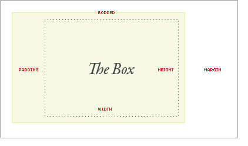

# Box-Model




Values:

* Margin
* Border
* Padding
* Height
* Width


* If **`padding`**or **`border`** are **undeclared**, they are either **zero** \(likely if you are using a [css reset](https://css-tricks.com/poll-results-what-css-reset-do-you-use/)\) or the **browser default value** \(**probably not zero** especially on form elements that are commonly not reset\).
* 
## Width

* If **`width`** is **undeclared** , and the box has **`static` \(default\)** or **`relative`** positioning, the width will **remain 100%** in width
  * the **`padding`** and **`border`** will **push** _**inwards**_ **instead of outward.**
*  if **`width`**is **explicitly set**  __of the box to be **100%**, 
  * the **`padding`** will **push the box** _**outward**_  **as normal**.
* **default** **`width`** of a box **isn’t** really **100%** **but** a less tangible **“whatever is left”**. 


Values:

* Length values \(e.g. px, em, rem, ex, etc\) 
* percentages
* auto

## Margin

* Defines the **outermost portion** of the box model, creating space around an element, outside of any defined borders.
* Margin is unique in that it doesn’t affect the size of the box itself per se, but it affects _other_ content interacting with the box

Values:

* Length values \(e.g. px, em, rem, ex, etc\) 
* percentages
* auto
* negative values \(with above values\)

```css
.box {
margin: <margin-top> || <margin-right> || <margin-bottom> || <margin-left>
margin-bottom: 20px;
margin-top: 20px;
}
```

## Padding

* defines the **innermost portion** of the box model, creating space around an element’s content, inside of any defined margins and/or borders.

```css
.box {
padding: <padding-top> || <padding-right> || <padding-bottom> || <padding-left>
padding-right: 20px;
padding-bottom: 20px;
}
```

Values:

* Length values \(e.g. px, em, rem, ex, etc\) 
* percentages

## width / height

the width/ height of the element’s content area. This “content” area is the portion inside the **`padding`**, **`border`**, and **`margin`** of an element \(the box model\).

### max/min-height/width

property in CSS is used to set the maximum height of a specified element. Authors may use any of the length values as long as they are a positive value. max-height overrides height, but min-height always overrides max-height.

Values:

* Length values \(e.g. px, em, rem, ex, etc\)
* **`min-content`** value is the smallest measure that would fit around its content if all **soft wrap opportunities** within the box were taken.
* **`max-content`** property refers to the narrowest measure a box could take while fitting around its content – if no soft wrap opportunities within the element were taken.
* **`fit-content`** value is roughly equivalent to margin-left: auto and margin-right: auto in behaviour, except it works for unknown widths.


